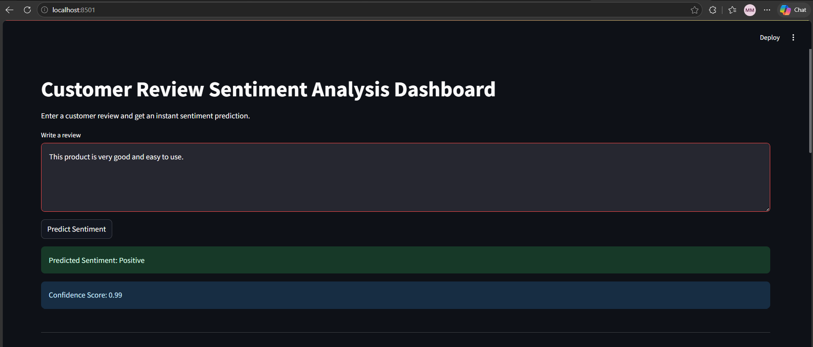
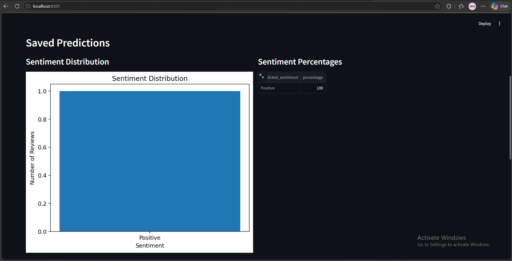
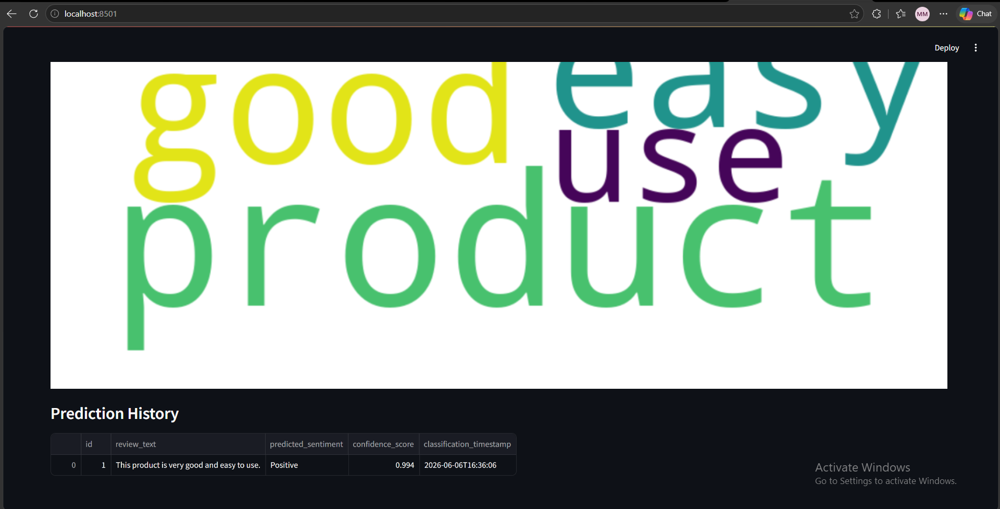

# Customer Review Sentiment Analysis Dashboard

This project is an end-to-end NLP system for customer review sentiment analysis.
It classifies reviews as **Positive**, **Negative**, or **Neutral**, stores predictions in an SQL database, and shows analytics in a Streamlit dashboard.

## Project Requirements Covered

- Text cleaning
- Lowercase conversion
- Stopword removal
- Tokenization by words
- TF-IDF feature extraction
- Three machine learning models:
  - Logistic Regression
  - Naive Bayes
  - Support Vector Machine (SVM)
- Evaluation metrics:
  - Accuracy
  - Precision
  - Recall
  - F1-Score
  - Confusion Matrix
- SQLite database storing:
  - Review text
  - Predicted sentiment
  - Confidence score
  - Classification timestamp
- Streamlit dashboard
- Docker support

## Dataset

Use the Amazon Reviews dataset from Kaggle:

https://www.kaggle.com/datasets/bittlingmayer/amazonreviews

Put the dataset file inside:

```text
data/raw/
```

Supported formats:

1. FastText text format:

```text
__label__1 bad product
__label__2 great product
```

2. CSV format with columns like:

```text
review,label
text,sentiment
review_text,sentiment
```

## Project Structure

```text
sentiment-analysis-dashboard/
├── app.py
├── requirements.txt
├── Dockerfile
├── docker-compose.yml
├── README.md
├── data/
│   ├── raw/
│   └── processed/
├── database/
├── models/
├── notebooks/
├── screenshots/
└── src/
    ├── preprocess.py
    ├── train_models.py
    ├── predict.py
    └── database.py
```

## Installation

```bash
python -m venv venv
source venv/bin/activate   # Windows: venv\\Scripts\\activate
pip install -r requirements.txt
```

## Train the Models

Example:

```bash
python src/train_models.py --data data/raw/train.ft.txt
```

After training, the system creates:

```text
models/best_sentiment_model.joblib
models/model_comparison.csv
models/evaluation_results.json
```

## Run the Dashboard

```bash
streamlit run app.py
```

Open:

```text
http://localhost:8501
```

## Run with Docker

```bash
docker compose up --build
```

## Model Selection Rationale

The project compares three classical machine learning models for text classification.
Logistic Regression is strong for TF-IDF text features.
Naive Bayes is fast and common for NLP classification.
SVM often performs well on sparse text data.
The best model is selected using weighted F1-score.

## SQL Database Design

Table: `predictions`

| Column | Type | Description |
|---|---|---|
| id | INTEGER | Primary key |
| review_text | TEXT | User review |
| predicted_sentiment | TEXT | Positive, Negative, or Neutral |
| confidence_score | REAL | Model confidence |
| classification_timestamp | TEXT | Prediction time |

## Suggested Git Commit Plan

```bash
git init
git add .
git commit -m "Initial project structure"
git commit -m "Add text preprocessing pipeline"
git commit -m "Add model training and evaluation"
git commit -m "Add SQLite prediction storage"
git commit -m "Add Streamlit dashboard"
git commit -m "Add Docker configuration"
git commit -m "Update README with installation instructions"
```

## Screenshots


## Dashboard Screenshots

### Prediction Result


### Sentiment Distribution


### Prediction History
